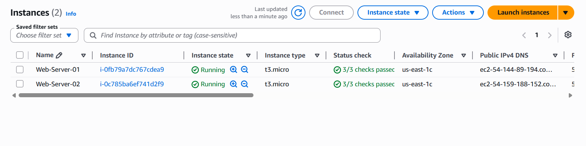
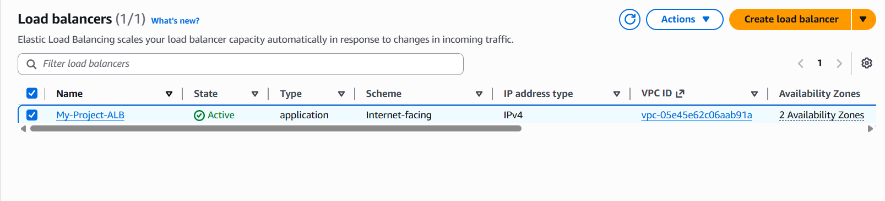
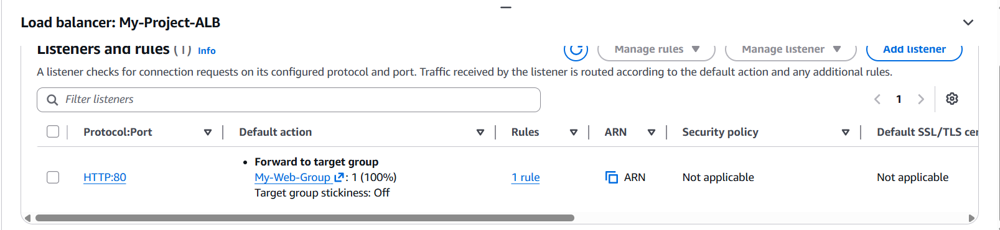
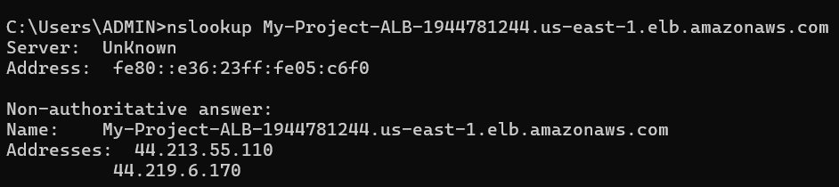

# AWS Scalable & Secure Infrastructure Project

## 📌 Project Overview
This project demonstrates the deployment of a secure and highly available web infrastructure on AWS.

The project includes:

- Secure S3 Storage with CloudTrail & CloudWatch logging
- Scalable EC2 hosting using an Application Load Balancer (ALB)

---

# 🏗️ Architecture

- Amazon S3 (Private Bucket)
- AWS CloudTrail
- Amazon CloudWatch
- EC2 Instances
- Application Load Balancer (ALB)

---

# 📸 Deployment Proof

## 🔐 Task 1 – Secure Logging

### Bucket Privacy


### S3 File Upload


### CloudWatch JSON Logs


---

## ⚖️ Task 2 – Load Balancing & Availability

### EC2 Instances Running


### ALB Active State


### ALB Listener Rules


### Healthy Target Group


### ALB DNS Lookup Proof


---

# 🚀 How to Access

```bash
http://My-Project-ALB-1944781244.us-east-1.elb.amazonaws.com
```

---

# 🛠️ Skills Demonstrated

## 🔒 Security
- IAM
- Security Groups
- S3 Bucket Policies

## 📊 Monitoring
- AWS CloudTrail
- CloudWatch Log Groups

## 🌐 Networking
- Application Load Balancer (ALB)
- Target Groups
- DNS (`nslookup`)

## 💻 Compute
- EC2 Provisioning
- Apache Web Server
- User Data Scripts

---

# 📚 Technologies Used

- Amazon EC2
- Amazon S3
- CloudTrail
- CloudWatch
- Application Load Balancer
- Apache HTTP Server
- Linux

---

# ✅ Project Outcome

Successfully deployed a secure, scalable, and monitored AWS infrastructure capable of:

- Blocking unauthorized public access
- Tracking storage activity in real-time
- Load balancing traffic between servers
- Ensuring high availability

---

# 👨‍💻 Author

**Dusyaant**  
